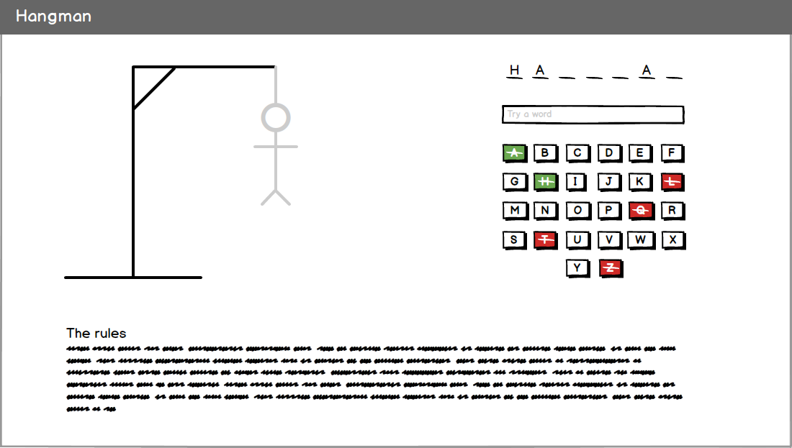
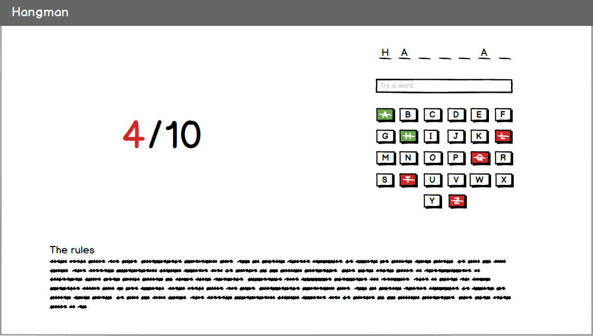
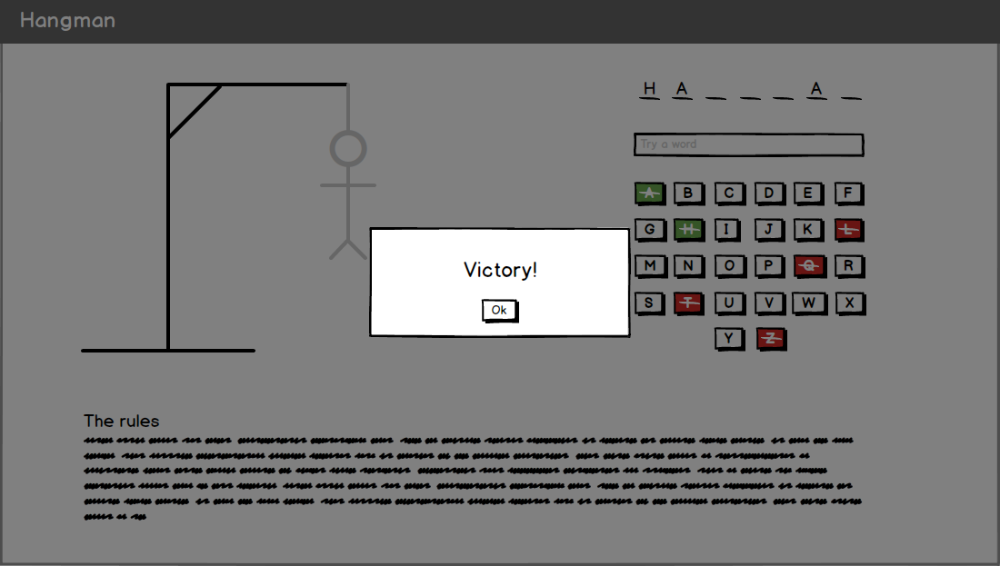
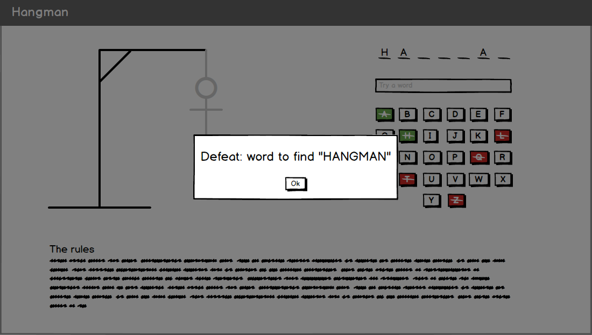
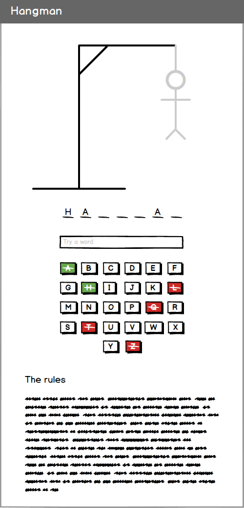

Hangman : Le jeu du pendu
=========================

Sujet d'évaluation pour le module Javascript. Vous trouverez ci-dessous les règles du jeu, les mockups à respecter ainsi
que les modalités de l'examen.

Si vous ne connaissez pas le jeu => [Wikipédia](https://fr.wikipedia.org/wiki/Jeu_du_pendu).

## Les règles

1. La partie est automatiquement démarré au chargement de la page.
2. Le jeu choisit aléatoirement le mot à trouver parmis une liste que vous aurez créé.
3. Le jeu doit afficher le nombre de lettres du mot sous forme d'espace à remplir (cf. mockups).
4. Le joueur doit deviner le mot.
5. Il peut choisir une lettre, si cette lettre est présente dans le mot, elle est ajouté sur les espaces correspondants.
6. Si la lettre n'existe pas, il perd un essai.
7. Après 10 essais ratés, le joueur a perdu la partie.

## Les contraintes

Vous avez le droit d'utiliser Internet, vos notes de cours et les corrigés d'exercices.

### Obligatoires

- Vous pouvez utiliser ce que vous voulez pour le CSS.
- Lorsqu'une lettre est sélectionnée, elle est barrée puis colorée en rouge ou vert si respectivement fausse ou correcte.
- Afficher un message lors de la fin de partie. Si défaite, afficher aussi le mot à trouver.
- Après la fin d'une partie, recommencer automatiquement une nouvelle partie.

### La structure

Les fichiers/dossiers que vous devez créer au minimum.

- **index.html** : La page principale du jeu (la seule page).
- **scripts** : Le dossier où vous ajouterez vos fichiers JS.
- **styles** : Le dossier où vous ajouterez vos fichiers CSS.

### À choisir

Pour afficher votre choix, modifier ce fichier en barrant les options non retenues. Pour barrer une option, entourez le texte
avec un double tilde `~`.

- Exemple :
    1. ~~Choix 1~~
    2. Choix 2

- Affichage du pendu :
    1. Dessiner un « vrai » pendu qui s'affiche complètement au fur et à mesure de la partie (cf. mockup main-screen).
    2. Afficher un compteur de raté (cf. mockup light-screen).
    3. Création graphique.

- Respecter les mockups :
    1. Respect strict.
    2. Création graphique.

- Responsive :
    1. Oui
    2. Non

## Mockups

*main-screen*

*light-screen*

*victory-message*

*defeat-message*

*main-screen-mobile*

## Modalité

- Envoyer votre code par Merge Request sur ce dépôt avant la fin du cours.
- Vous avez le droit à 1 joker pendant l'examen : si vous êtes bloqué sur un point, vous pouvez me poser une question.
Cela peut inclure l'écriture d'une ou deux lignes de code sur votre examen. Choisissez bien votre question ;)

## Bonus

- Ajouter un choix de 3 difficultés. La difficulté est basée sur la liste de mot (faire 3 listes de mots).
- Faire retenir les mots passés entre les parties pour ne pas retomber dessus sur les parties suivantes. Remettre à zéro
cette « mémoire » une fois tous les mots passés.
- Utiliser les touches du clavier pour déclancher les boutons de lettre.
- Ajouter une musique d'ambiance pendant le jeu, une musique de victore et une de défaite.
